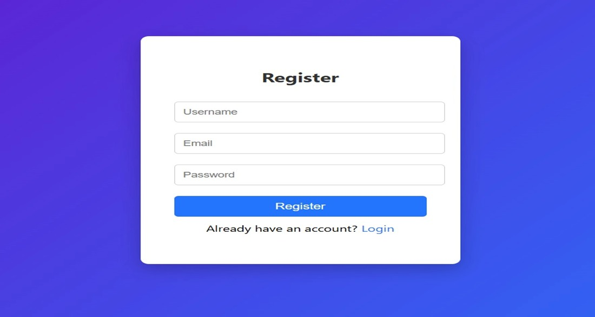

# 🎬 Movie-Reviews-and-Rating-System 

## Description
This project is built using MERN Stack. It allows users to view movies and give reviews.

## Features
- Login & Registration
- View Movies
- Add Reviews
- Ratings

## How to Run
1. Download the project
2. Open in VS Code
3. Run backend and frontend

## Screenshots
Registration Window: 
 Displays the registration interface where a new user enters username, email, and 
Password to create an account.

Login Window:
Displays the login interface where the user enters email and password to access the System.

Language Selection Window:
Displays the interface where users can select their preferred movie language to browse movies accordingly.

Home page Window:
Provides the main interface where users can browse available movies displayed from the TMDB API.

Search Movie Window:
Displays the search interface where users can search for movies by entering the movie title.

Movie Details Window:
Displays complete information about the selected movie such as title, poster, release date, runtime, genres, and overview

Cast Details Screen:
Shows the cast members of the selected movie along with their profile images.

User Reviews Window:
Displays all user-submitted reviews and ratings for the selected movie

Review Submission Window:
Displays the interface where logged-in users can submit ratings and reviews for a selected movie.

Review Update Window:
 Shows the interface used to edit or update an existing user review and rating.

Average Rating Display Screen:
Displays the calculated average rating of the movie based on user-submitted ratings

